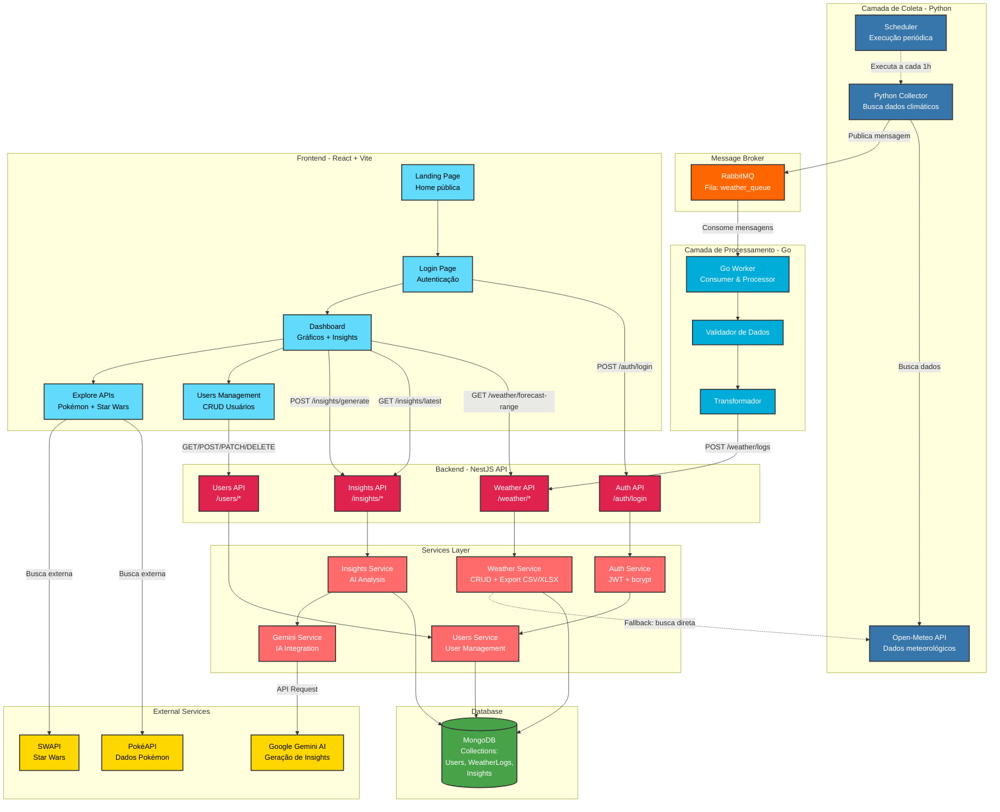

# WeAIther - Weather Monitoring with AI

Sistema full-stack de coleta, processamento e visualização de dados climáticos com insights de IA.
Desenvolvido para o processo seletivo GDASH 2025/02.

## 🛠️ Stack Tecnológica

- **Frontend:** React + Vite + TypeScript + Tailwind CSS + shadcn/ui
- **Backend:** NestJS + TypeScript + MongoDB
- **Worker:** Go + RabbitMQ
- **Collector:** Python
- **IA:** Google Gemini 2.5 Flash-Lite (insights meteorológicos)
- **Infraestrutura:** Docker Compose

## 🔑 Variáveis de Ambiente

O projeto utiliza variáveis de ambiente para configuração. Existe um arquivo `.env.example` na raiz do projeto com todas as configurações necessárias.

**⚠️ Variável OBRIGATÓRIA:**
- `GOOGLE_GEMINI_API_KEY` - Chave de API do Google Gemini para gerar insights de IA

**Como obter a API Key:**
1. Acesse [Google AI Studio](https://aistudio.google.com/app/apikey)
2. Clique em "Create API Key" 
3. Copie a chave gerada
4. Cole no arquivo `.env` na variável `GOOGLE_GEMINI_API_KEY`

O sistema usa o modelo `gemini-2.5-flash-lite` (gratuito, 1000 requisições/dia).

**Outras variáveis importantes** (já configuradas no `.env.example`):
- MongoDB, RabbitMQ, JWT Secret, localização padrão (Florianópolis), portas, etc.

## 📁 Estrutura do Projeto

```
desafio-gdash-2025-02/
├── backend/                      # API NestJS
│   ├── src/
│   │   ├── auth/                # Autenticação JWT
│   │   │   ├── strategies/      # Passport strategies
│   │   │   ├── guards/          # Auth guards
│   │   │   └── dto/             # DTOs de autenticação
│   │   ├── users/               # CRUD de usuários
│   │   │   ├── schemas/         # Mongoose schemas
│   │   │   └── dto/             # DTOs de usuários
│   │   ├── weather/             # Logs climáticos
│   │   │   ├── schema/          # WeatherLog schema
│   │   │   ├── dto/             # DTOs de clima
│   │   │   └── services/        # Services auxiliares
│   │   ├── insights/            # Insights de IA
│   │   │   ├── ai/              # Gemini service
│   │   │   └── schemas/         # Insight schema
│   │   ├── external-api/        # API externa (PokéAPI)
│   │   ├── common/              # Decorators, filters, guards
│   │   └── main.ts              # Entry point
│   ├── test/                    # Testes E2E
│   ├── coverage/                # Relatórios de cobertura
│   ├── Dockerfile
│   └── package.json
│
├── frontend/                    # React Dashboard
│   ├── src/
│   │   ├── components/         # Componentes reutilizáveis
│   │   │   ├── dashboard/      # Componentes do dashboard
│   │   │   ├── users/          # Componentes de usuários
│   │   │   ├── explore/        # Explore APIs
│   │   │   ├── layout/         # Header, Sidebar
│   │   │   └── ui/             # shadcn/ui components
│   │   ├── pages/              # Páginas principais
│   │   ├── contexts/           # React contexts (Auth)
│   │   ├── hooks/              # Custom hooks
│   │   ├── services/           # API clients
│   │   ├── lib/                # Utils e helpers
│   │   └── types/              # TypeScript types
│   ├── public/                 # Assets estáticos
│   ├── Dockerfile
│   └── package.json
│
├── python-collector/           # Coletor de dados climáticos
│   ├── collector.py            # Script principal (loop infinito)
│   ├── populate_historical.py  # Popular histórico inicial
│   ├── requirements.txt
│   ├── Dockerfile
│   └── .env.example
│
├── go-worker/                  # Worker de processamento
│   ├── main.go                 # Entry point
│   ├── client/                 # HTTP client para API
│   ├── consumer/               # RabbitMQ consumer
│   ├── config/                 # Configurações
│   ├── models/                 # Data models
│   ├── go.mod
│   ├── Dockerfile
│   └── .env.example
│
├── docker-compose.yml          # Orquestração de containers
├── .env.example               # Template de variáveis de ambiente
├── .gitignore
└── README.md
```

## 🏗️ Arquitetura

O sistema segue uma arquitetura baseada em microserviços com processamento assíncrono de mensagens:



## 🔄 Fluxo de Dados

### Pipeline Completo

1. **Coleta (Python):** A cada 1 hora, `python-collector/collector.py` busca dados climáticos da Open-Meteo API
2. **Fila (RabbitMQ):** Dados são publicados na fila `weather-data`
3. **Processamento (Go Worker):** Consome mensagens, valida e transforma os dados
4. **API (NestJS):** Go Worker envia `POST /weather/logs` → salva no MongoDB com TTL (7 dias para dados horários, 13 meses para dados diários)
5. **Frontend (React):** Consome dados via REST API e exibe gráficos interativos
6. **Insights IA:** Gerados sob demanda via `POST /insights/generate` usando Google Gemini AI

### Seed Automático

Ao iniciar os containers, o sistema verifica automaticamente se há dados dos últimos 7 dias no MongoDB. Caso não existam, executa `seedInitialData()` buscando histórico da Forecast API para popular o dashboard.

## 🚀 Como Rodar

### Pré-requisitos

- **Docker e Docker Compose** instalados ([Download](https://www.docker.com/products/docker-desktop))
- **Node.js 18+** (apenas se for rodar serviços individualmente)
- **Python 3.9+** (apenas se for rodar serviços individualmente)
- **Go 1.20+** (apenas se for rodar serviços individualmente)

### 📋 Guia Passo a Passo

#### Passo 1: Configurar Variáveis de Ambiente

**Opção 1 - Windows (PowerShell):**
```powershell
# Duplicar o arquivo .env.example como .env
Copy-Item .env.example .env
```

**Opção 2 - Linux/Mac:**
```bash
cp .env.example .env
```

**Opção 3 - Manualmente:**
1. Duplicar o arquivo `.env.example`
2. Renomear a cópia para `.env`

**Depois, editar o arquivo `.env`:**
1. Abrir o arquivo `.env` em um editor de texto (VSCode, Notepad++, etc.)
2. Localizar a linha `GOOGLE_GEMINI_API_KEY=INSIRA_SUA_API_KEY_AQUI`
3. Substituir `INSIRA_SUA_API_KEY_AQUI` pela sua chave da Google AI
4. Salvar o arquivo

**⚠️ IMPORTANTE:** Sem a API Key do Gemini, os insights de IA não funcionarão!

#### Passo 2: Subir os Containers

```bash
# Subir todos os serviços (MongoDB, RabbitMQ, Backend, Frontend, Workers)
docker-compose up -d

# Ver logs em tempo real (útil para debug)
docker-compose logs -f

# Ver logs de um serviço específico
docker-compose logs -f backend
docker-compose logs -f python-collector
```

#### Passo 3: Aguardar Inicialização

Os serviços levam alguns segundos para inicializar completamente:
- **MongoDB**: ~5-10 segundos
- **RabbitMQ**: ~10-15 segundos
- **Backend**: ~15-20 segundos (aguarda MongoDB)
- **Frontend**: ~5-10 segundos
- **Workers**: ~5 segundos (aguardam RabbitMQ)

#### Passo 4: Verificar Status

```bash
# Verificar se todos os containers estão rodando
docker-compose ps

# Todos devem estar com status "Up"
```

### Acessar Aplicação

- **Frontend:** http://localhost:3000
- **API:** http://localhost:3001
- **API Docs (Swagger):** http://localhost:3001/api
- **RabbitMQ Management:** http://localhost:15672 (guest/guest)

### Credenciais Padrão

- **Email:** admin@example.com
- **Senha:** 123456

## 📡 Endpoints Principais da API

### Autenticação
- `POST /api/auth/login` - Login (retorna JWT token)
- `POST /api/auth/register` - Registrar novo usuário

### Usuários
- `GET /api/users` - Listar todos os usuários
- `GET /api/users/:id` - Buscar usuário por ID
- `POST /api/users` - Criar novo usuário
- `PATCH /api/users/:id` - Atualizar usuário
- `DELETE /api/users/:id` - Remover usuário

### Weather (Dados Climáticos)
- `GET /api/weather/logs` - Listar logs climáticos (com paginação)
- `GET /api/weather/logs/:id` - Buscar log específico
- `POST /api/weather/logs` - Criar log (usado pelo Go worker)
- `GET /api/weather/export/csv` - Exportar dados em CSV
- `GET /api/weather/export/xlsx` - Exportar dados em XLSX

### Insights (IA)
- `GET /api/insights` - Listar insights gerados
- `POST /api/insights/generate` - Gerar novos insights
- `GET /api/insights/latest` - Buscar último insight

### External API (Opcional)
- `GET /api/external/items` - Listar itens da PokéAPI (paginado)
- `GET /api/external/items/:id` - Detalhes de um item

**Documentação completa:** http://localhost:3001/api (Swagger)

## 🔧 Rodar Serviços Individualmente

### Backend (NestJS)
```bash
cd backend
npm install
npm run start:dev
# API disponível em http://localhost:3001
```

### Frontend (React)
```bash
cd frontend
npm install
npm run dev
# Frontend disponível em http://localhost:3000
```

### Python Collector
```bash
cd python-collector
pip install -r requirements.txt
python collect_weather.py
```

### Go Worker
```bash
cd go-worker
go mod download
go run main.go
```

**Observação:** Para rodar individualmente, você precisa ter MongoDB e RabbitMQ rodando localmente ou via Docker:
```bash
# Subir apenas MongoDB e RabbitMQ
docker-compose up mongodb rabbitmq -d
```

## 🧪 Testes

### Backend - NestJS

O projeto possui testes unitários básicos implementados:

**Módulos com testes:**
- ✅ Auth Service e Controller (autenticação JWT, bcrypt)
- ✅ Users Service e Controller (CRUD de usuários)
- ⚠️ Weather Service (7 testes escritos, alguns precisam de ajustes nos mocks)
- ✅ Insights Service e Controller
- ✅ External API Service e Controller

**Para rodar os testes:**

```bash
cd backend

# Instalar dependências (se necessário)
npm install

# Rodar testes
npm test

# Testes com cobertura
npm run test:cov

# Testes E2E
npm run test:e2e
```

**Nota:** Alguns testes do Weather Service podem falhar devido a mocks que precisam ser ajustados. Os testes de Auth e Users funcionam corretamente.

## 🐛 Troubleshooting

### Porta já em uso
Se você receber erro de porta ocupada:
```bash
# Verificar processos usando a porta
# Windows
netstat -ano | findstr :3000
netstat -ano | findstr :3001

# Parar o Docker Compose e tentar novamente
docker-compose down
docker-compose up -d
```

### Docker não sobe todos os containers
```bash
# Ver logs de todos os serviços
docker-compose logs

# Verificar status dos containers
docker-compose ps

# Recriar containers
docker-compose down
docker-compose up -d --build
```

### Erro de conexão com MongoDB
- Verifique se o MongoDB está rodando: `docker-compose ps mongodb`
- Confira a variável `MONGODB_URI` no `.env`
- Aguarde alguns segundos após subir os containers (MongoDB demora para iniciar)

### RabbitMQ não recebe mensagens
- Acesse o Management UI: http://localhost:15672
- Verifique se a fila `weather-data` existe
- Confira logs do Python collector: `docker-compose logs python-collector`
- Confira logs do Go worker: `docker-compose logs go-worker`

### Frontend não conecta na API
- Verifique a variável `VITE_API_URL` no `.env`
- Confira se o backend está rodando: http://localhost:3001/api
- Limpe o cache do navegador e recarregue a página

### "npm install" falha
```bash
# Limpar cache do npm
npm cache clean --force

# Deletar node_modules e reinstalar
rm -rf node_modules package-lock.json
npm install
```

## 🚀 Melhorias Futuras

Funcionalidades que podem ser implementadas em versões futuras:

- **Múltiplas Cidades:** Análise climática simultânea de diferentes localizações
- **Acurácia de Previsões:** Comparação entre previsões e dados reais para calcular taxa de acerto
- **Testes Completos:** Cobertura E2E completa de todos os fluxos (frontend + backend + workers)
- **Chat com IA:** Interface conversacional para perguntas sobre o clima em linguagem natural
- **Notificações:** Alertas automáticos para condições climáticas extremas
- **WebSockets:** Atualização em tempo real dos dados no dashboard

## 📹 Vídeo Explicativo

https://youtu.be/H-EftKme_ag